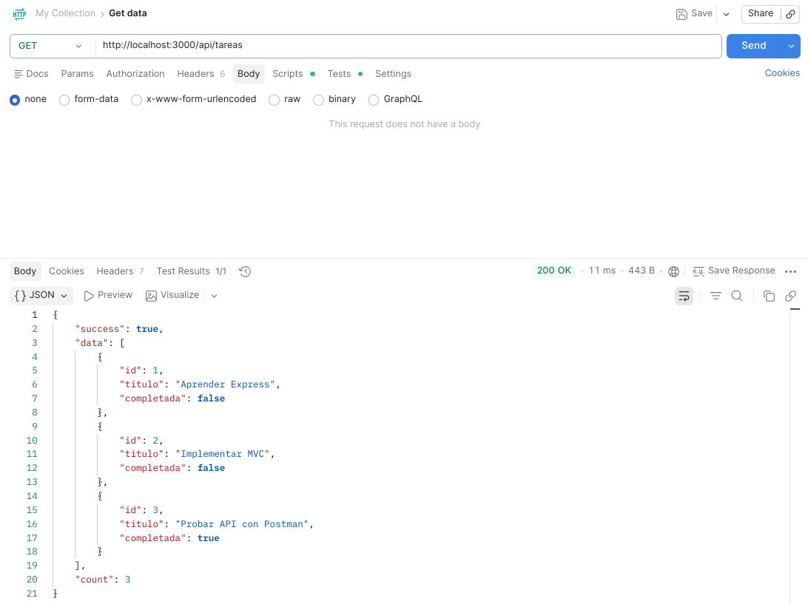
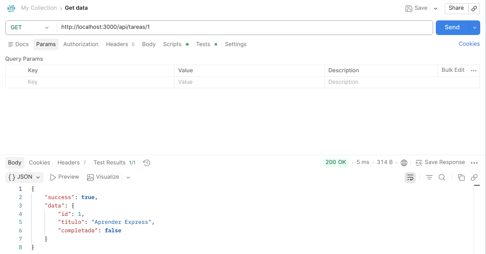
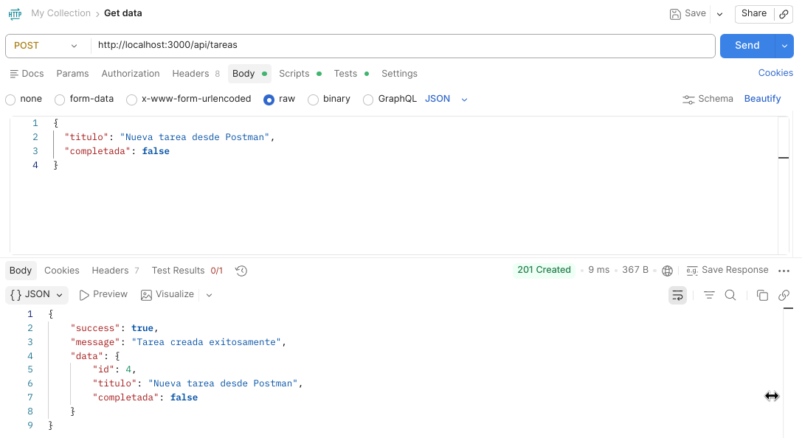
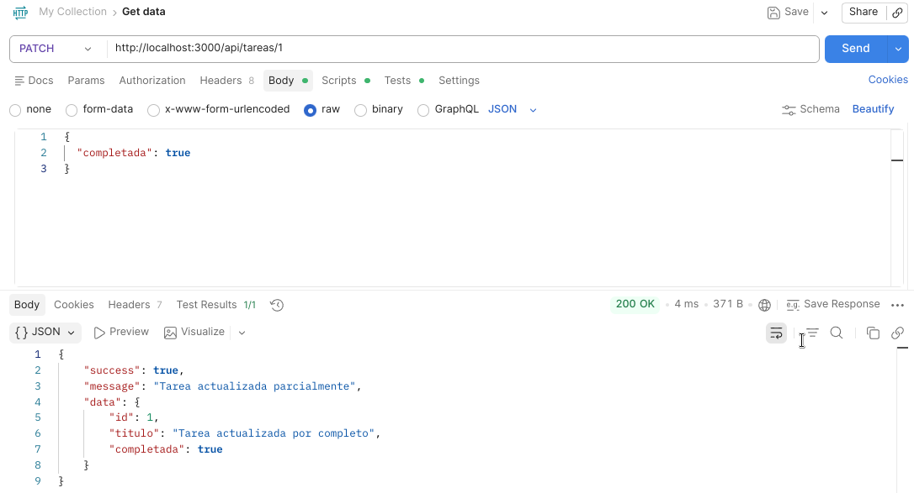
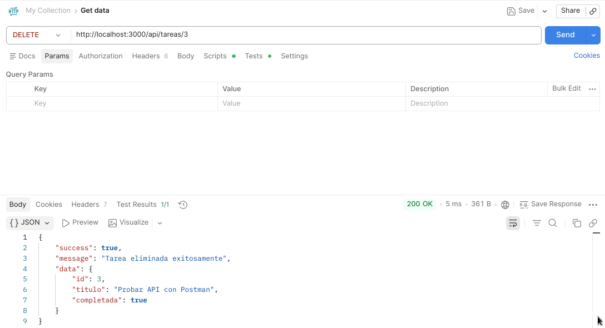

# API REST de Gestión de Tareas (MVC)

**Autor:** Jesús Emmanuel Inda Campos
**Matrícula:** 1190328
**Asignatura:** Desarrollo de Aplicaciones Web
**Programa:** Ingeniería en Computación
**Unidad:** Construcción del Backend

Esta es una API RESTful desarrollada con Node.js y Express para la gestión de tareas. Implementa las operaciones CRUD completas utilizando los 5 métodos HTTP principales (GET, POST, PUT, PATCH, DELETE) y sigue estrictamente el patrón de diseño MVC (Modelo-Vista-Controlador) con persistencia de datos en memoria.

## Tecnologías Utilizadas
* Node.js
* Express.js
* JavaScript (ES6+)

## Instrucciones de Instalación

1. Clonar el repositorio.
2. Abrir una terminal en la carpeta del proyecto.
3. Instalar las dependencias de Node.js:
```bash
   npm install
```

## Cómo Ejecutar el Servidor

Para iniciar el servidor en modo de desarrollo (con auto-recarga gracias a nodemon), ejecuta:

```bash
npm run dev
```

El servidor estará escuchando en `http://localhost:3000`.

## Endpoints Disponibles

| Método | Endpoint | Descripción |
|---|---|---|
| `GET` | `/api/tareas` | Obtiene todas las tareas en formato JSON. |
| `GET` | `/api/tareas?formato=text` | **(Extra)** Obtiene todas las tareas en formato de texto plano. |
| `GET` | `/api/tareas/buscar?q=termino` | **(Extra)** Busca tareas que contengan el término en su título. |
| `GET` | `/api/tareas/:id` | Obtiene los detalles de una tarea específica por su ID. |
| `POST` | `/api/tareas` | Crea una nueva tarea. Requiere `titulo` en el body. |
| `PUT` | `/api/tareas/:id` | Actualiza una tarea completa. Requiere `titulo` y `completada`. |
| `PATCH` | `/api/tareas/:id` | Actualiza campos específicos de una tarea (ej. solo `completada`). |
| `DELETE` | `/api/tareas/:id` | Elimina una tarea del sistema. |

## Pruebas de la API (Capturas de Pantalla)

A continuación se muestran las evidencias de funcionamiento de los endpoints utilizando Postman / Thunder Client:

### 1\. Obtener todas las tareas (GET)


### 2\. Buscar por título (GET Extra)


### 3\. Crear una nueva tarea (POST)


### 4\. Actualizar tarea completamente (PUT)


### 5\. Actualizar tarea parcialmente (PATCH)


### 6\. Eliminar tarea (DELETE)


```
```
